# Database Data Dictionary

This document details the database schema, models, field constraints, relationships, and usage patterns defined in [`prisma/schema.prisma`](file:///C:/save/Projects/PersonalWebsite/prisma/schema.prisma).

---

## Overview

The database is managed with **Prisma ORM** supporting SQLite (local development) and PostgreSQL (production). All tables use UUID strings as primary keys (`@id @default(uuid())`).

```mermaid
erDiagram
    SKILL {
        string id PK
        string name
        int proficiency
        string category
        string icon
        datetime createdAt
        datetime updatedAt
    }
    PROJECT {
        string id PK
        string title
        string description
        string imageUrl
        string demoUrl
        string repoUrl
        string tags
        datetime createdAt
        datetime updatedAt
    }
    EXPERIENCE {
        string id PK
        string role
        string company
        string location
        datetime startDate
        datetime endDate
        string description
        datetime createdAt
        datetime updatedAt
    }
    EDUCATION {
        string id PK
        string institution
        string degree
        string fieldOfStudy
        string faculty
        datetime startDate
        datetime endDate
        string score
        datetime createdAt
        datetime updatedAt
    }
    HOBBY {
        string id PK
        string name
        string emoji
        datetime createdAt
        datetime updatedAt
    }
    INTEREST {
        string id PK
        string name
        string emoji
        datetime createdAt
        datetime updatedAt
    }
    LANGUAGE {
        string id PK
        string name
        string proficiency
        datetime createdAt
        datetime updatedAt
    }
    MESSAGE {
        string id PK
        string name
        string email
        string message
        boolean read
        datetime createdAt
    }
    SOCIALLINK {
        string id PK
        string platform
        string url
        string icon
        string actionType
        int order
        datetime createdAt
        datetime updatedAt
    }
```

---

## 1. Model: `Skill`

Stores technical skills, proficiency ratings, and category classification.

| Column | Type | Attributes | Description |
| :--- | :--- | :--- | :--- |
| `id` | `String` | `@id @default(uuid())` | Unique identifier (UUID). |
| `name` | `String` | Required | Skill name (e.g. `React`, `TypeScript`, `Next.js`). |
| `proficiency` | `Int` | Required | Proficiency score from `0` to `100`. |
| `category` | `String` | Required | Category grouping (e.g. `Frontend`, `Backend`, `Tools`). |
| `icon` | `String?` | Optional | Custom icon identifier resolved via `PortfolioIcon.tsx`. |
| `createdAt` | `DateTime` | `@default(now())` | Record creation timestamp. |
| `updatedAt` | `DateTime` | `@updatedAt` | Last modification timestamp. |

---

## 2. Model: `Project`

Stores showcase projects, external preview links, screenshots, and tech stacks.

| Column | Type | Attributes | Description |
| :--- | :--- | :--- | :--- |
| `id` | `String` | `@id @default(uuid())` | Unique identifier (UUID). |
| `title` | `String` | Required | Project headline/name. |
| `description` | `String` | Required | Short summary of the project. |
| `imageUrl` | `String?` | Optional | Featured thumbnail or header image URL. |
| `demoUrl` | `String?` | Optional | Live deployment / interactive web URL. |
| `repoUrl` | `String?` | Optional | GitHub / Git repository URL. |
| `tags` | `String` | Required | Comma-separated list or JSON array of tech badges. |
| `createdAt` | `DateTime` | `@default(now())` | Record creation timestamp. |
| `updatedAt` | `DateTime` | `@updatedAt` | Last modification timestamp. |

---

## 3. Model: `Experience`

Stores employment and career history entries.

| Column | Type | Attributes | Description |
| :--- | :--- | :--- | :--- |
| `id` | `String` | `@id @default(uuid())` | Unique identifier (UUID). |
| `role` | `String` | Required | Job title or role. |
| `company` | `String` | Required | Company or organization name. |
| `location` | `String?` | Optional | Office location, city, or remote designation. |
| `startDate` | `DateTime` | Required | Employment start date. |
| `endDate` | `DateTime?` | Optional | Employment conclusion date (`null` indicates present). |
| `description` | `String` | Required | Summary of responsibilities, achievements, and impact. |
| `createdAt` | `DateTime` | `@default(now())` | Record creation timestamp. |
| `updatedAt` | `DateTime` | `@updatedAt` | Last modification timestamp. |

---

## 4. Model: `Education`

Stores academic history, degrees, universities, and performance scores.

| Column | Type | Attributes | Description |
| :--- | :--- | :--- | :--- |
| `id` | `String` | `@id @default(uuid())` | Unique identifier (UUID). |
| `institution` | `String` | Required | University, college, or school name. |
| `degree` | `String` | Required | Degree level (e.g. `Bachelor of Science`). |
| `fieldOfStudy` | `String` | Required | Major / field of study (e.g. `Computer Science`). |
| `faculty` | `String?` | Optional | Specific faculty (e.g. `Faculty of ICT`). |
| `startDate` | `DateTime` | Required | Academic enrollment start date. |
| `endDate` | `DateTime?` | Optional | Graduation date (`null` indicates ongoing). |
| `score` | `String?` | Optional | GPA, honors, or class rank (e.g. `3.92 / 4.00`). |
| `createdAt` | `DateTime` | `@default(now())` | Record creation timestamp. |
| `updatedAt` | `DateTime` | `@updatedAt` | Last modification timestamp. |

---

## 5. Model: `Hobby`

Stores personal interests, hobbies, and leisure activities.

| Column | Type | Attributes | Description |
| :--- | :--- | :--- | :--- |
| `id` | `String` | `@id @default(uuid())` | Unique identifier (UUID). |
| `name` | `String` | Required | Hobby name (e.g. `Weightlifting`, `Chess`). |
| `emoji` | `String?` | Optional | Unicode emoji icon representation. |
| `createdAt` | `DateTime` | `@default(now())` | Record creation timestamp. |
| `updatedAt` | `DateTime` | `@updatedAt` | Last modification timestamp. |

---

## 6. Model: `Interest`

Stores areas of technical and domain curiosity.

| Column | Type | Attributes | Description |
| :--- | :--- | :--- | :--- |
| `id` | `String` | `@id @default(uuid())` | Unique identifier (UUID). |
| `name` | `String` | Required | Interest title (e.g. `Autonomous AI Swarms`, `Distributed Systems`). |
| `emoji` | `String?` | Optional | Unicode emoji icon representation. |
| `createdAt` | `DateTime` | `@default(now())` | Record creation timestamp. |
| `updatedAt` | `DateTime` | `@updatedAt` | Last modification timestamp. |

---

## 7. Model: `Language`

Stores spoken and written languages along with fluency classifications.

| Column | Type | Attributes | Description |
| :--- | :--- | :--- | :--- |
| `id` | `String` | `@id @default(uuid())` | Unique identifier (UUID). |
| `name` | `String` | Required | Language name (e.g. `English`, `Thai`, `Japanese`). |
| `proficiency` | `String` | Required | Proficiency level (e.g. `Native`, `Professional Working`, `Elementary`). |
| `createdAt` | `DateTime` | `@default(now())` | Record creation timestamp. |
| `updatedAt` | `DateTime` | `@updatedAt` | Last modification timestamp. |

---

## 8. Model: `Message`

Stores contact inquiries submitted by visitors through the public contact form.

| Column | Type | Attributes | Description |
| :--- | :--- | :--- | :--- |
| `id` | `String` | `@id @default(uuid())` | Unique identifier (UUID). |
| `name` | `String` | Required | Inquirer's full name. |
| `email` | `String` | Required | Inquirer's return email address. |
| `message` | `String` | Required | Inquiry content or message body. |
| `read` | `Boolean` | `@default(false)` | Flag indicating whether the admin has viewed the message. |
| `createdAt` | `DateTime` | `@default(now())` | Submission timestamp. |

---

## 9. Model: `SocialLink`

Stores social platform handles, profile URLs, and interaction modes.

| Column | Type | Attributes | Description |
| :--- | :--- | :--- | :--- |
| `id` | `String` | `@id @default(uuid())` | Unique identifier (UUID). |
| `platform` | `String` | Required | Platform name (`GitHub`, `LinkedIn`, `Discord`, `Email`, etc.). |
| `url` | `String` | Required | Profile link or text snippet. |
| `icon` | `String?` | Optional | Custom icon identifier. |
| `actionType` | `String` | `@default("redirect")` | Interaction mode: `"redirect"` (opens link) or `"copy"` (copies handle to clipboard). |
| `order` | `Int` | `@default(0)` | Integer sorting index. |
| `createdAt` | `DateTime` | `@default(now())` | Record creation timestamp. |
| `updatedAt` | `DateTime` | `@updatedAt` | Last modification timestamp. |
