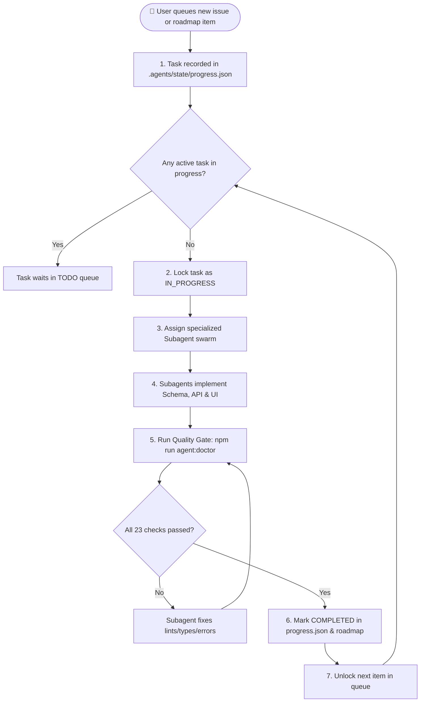
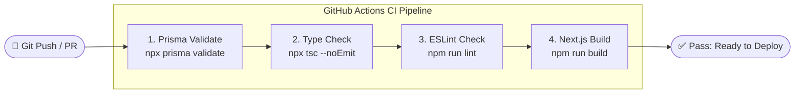

# Interactive Workflows & Flowcharts

This page illustrates the core engineering workflows in this repository through interactive Mermaid diagrams.

---

## 1. Continuous Task & Issue Queue Workflow

How tasks are created, locked, executed, verified, and completed autonomously across single or multiple terminal sessions.

---

## 2. Multi-Agent Swarm & Peer Consensus Workflow

How specialized subagents collaborate, discuss API contracts, and agree on technical solutions before committing code.

```mermaid
sequenceDiagram
    autonumber
    actor User as 👤 Developer / User
    participant Lead as 🤖 Lead Agent (Orchestrator)
    participant DB as 🗄️ db-engineer
    participant UI as 🎨 ui-designer
    participant Doc as 📝 doc-writer

    User->>Lead: "Implement Issue #2: Rich Media Project Cards"
    Lead->>Lead: Break down task (DB Schema + Video UI + ADR)
    Lead-->>User: Propose Swarm: db-engineer + ui-designer + doc-writer
    User->>Lead: Approve

    rect rgb(20, 30, 45)
    Note over DB,UI: Peer Discussion & Interface Consensus
    UI->>DB: "What field names for video and gallery screenshots?"
    DB-->>UI: "videoPreviewUrl (String?) and galleryImages (String? CSV)"
    UI->>DB: "Agreed. Default to nullable so existing records don't break."
    end

    par Parallel Database & Doc Creation
        DB->>DB: Update schema.prisma & run prisma db push
    and
        Doc->>Doc: Draft ADR in docs/adr/
    end

    DB-->>UI: "Schema pushed and Prisma Client generated"
    UI->>UI: Build ProjectMediaPreview.tsx with Framer Motion

    Lead->>Lead: Execute npm run agent:doctor & build
    Lead-->>User: "Issue #2 completed and verified! (23/23 passed)"
```

---

## 3. 4-Stage CI/CD Quality Gate Pipeline

Every Pull Request and commit to `main` must pass all 4 quality gates in `.github/workflows/ci.yml`.

